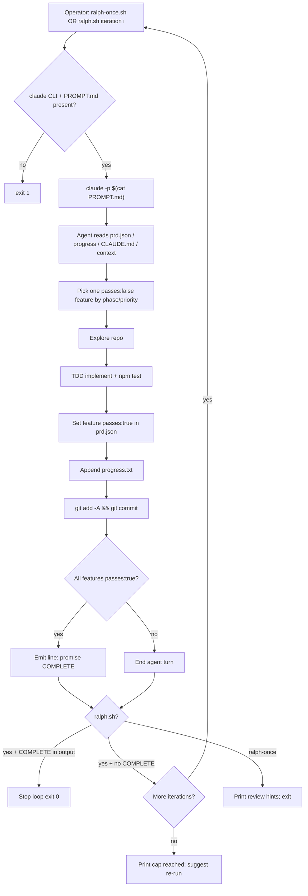

# Research: Ralph bootstrap loop as it runs today

**Ticket:** [Ralph bootstrap loop as it runs today](https://github.com/nholder88/ai-agent-workflows/issues/22) (map: [#21](https://github.com/nholder88/ai-agent-workflows/issues/21))  
**Branch:** `research/ralph-bootstrap-loop`  
**Scope:** How Autocode’s Ralph / Bootstrap Loop executes today — scripts, prompt, `prd.json`, `progress.txt`, stop conditions, commits, and one end-to-end iteration. Facts only; no Pack↔Autocode Seam or Demarcation design.  
**Primary sources:** `C:\Users\nhold\Code\pocketDev_Autocode` — `ralph.sh`, `ralph-once.sh`, `PROMPT.md`, `prd.json`, `progress.txt`, `CONTEXT.md`, `docs/prd/unified-work-loop.md`. Cross-check: root `package.json` (no Ralph scripts).

---

## Naming

| Name in sources | What it denotes |
|---|---|
| **Ralph** / `ralph.sh` / `ralph-once.sh` | Shell harness that drives Claude Code with `PROMPT.md` against this repo’s own backlog. |
| **Bootstrap Loop** | Glossary term for that same path: iterates Autocode’s `prd.json` features; intended to be retired after Unified Work Loop can dogfood this repo. |

**Sources:** [`CONTEXT.md`](file:///C:/Users/nhold/Code/pocketDev_Autocode/CONTEXT.md) (Bootstrap Loop); [`docs/prd/unified-work-loop.md`](file:///C:/Users/nhold/Code/pocketDev_Autocode/docs/prd/unified-work-loop.md) L5, L9, L48, L68, L86; script headers in `ralph.sh` / `ralph-once.sh`.

---

## Entry points and prerequisites

### Scripts (repo root)

| Script | Role |
|---|---|
| `./ralph.sh [iterations]` | Multi-iteration AFK loop. Default `iterations=10` if omitted. Hard cap: if requested > 50, capped at 50. |
| `./ralph-once.sh` | Exactly one Claude invocation (HITL / inspect mode). No COMPLETE detection. |

Both require:

1. `claude` on `PATH` (Claude Code CLI); otherwise exit 1 with install URL.
2. `PROMPT.md` present in the current working directory (repo root); otherwise exit 1.

Neither script is wired through npm: root `package.json` has no `ralph` / `PROMPT` / `prd` scripts. Invocation is direct bash.

**Sources:** [`ralph.sh`](file:///C:/Users/nhold/Code/pocketDev_Autocode/ralph.sh) L1–34, L18–23; [`ralph-once.sh`](file:///C:/Users/nhold/Code/pocketDev_Autocode/ralph-once.sh) L1–21; `package.json` (grep: no matches for ralph/prd/progress/PROMPT).

### Agent invocation

Both scripts run Claude Code in print/prompt mode:

```bash
claude -p "$(cat PROMPT.md)"
```

- `ralph.sh` captures stdout+stderr (`2>&1`) into `result`, echoes it, then searches that string for the COMPLETE token.
- `ralph-once.sh` streams Claude’s output to the terminal and does not inspect it for COMPLETE.

**Sources:** [`ralph.sh`](file:///C:/Users/nhold/Code/pocketDev_Autocode/ralph.sh) L46–54; [`ralph-once.sh`](file:///C:/Users/nhold/Code/pocketDev_Autocode/ralph-once.sh) L26.

---

## Prompt contract (`PROMPT.md`)

`PROMPT.md` is the entire agent instruction payload. It `@`-includes (Claude Code file refs):

- `@CLAUDE.md`
- `@project-context.md`
- `@prd.json`
- `@progress.txt`

### Per-iteration task (ordered)

1. **Select work** — In `prd.json`, find highest-priority feature with `"passes": false`, phases ascending (1 → 2 → …). Within a phase, pick the most impactful unblocked item; implement dependencies first if blocking.
2. **Explore** — `pwd`, git log, relevant files before edits.
3. **Standards** — CLAUDE.md non-negotiables: TDD first, TypeScript strict / no `any`, service-layer routes, React hooks-only, explicit async error handling.
4. **Implement E2E** — failing tests → implement → no regressions.
5. **`npm test`** — previously passing tests must still pass.
6. **Update `prd.json`** — set that feature’s `"passes": true` only (do not flip others).
7. **Append `progress.txt`** — feature id/name, files created/modified, test results, ISO 8601 timestamp.
8. **Commit** — `git add -A && git commit -m "feat(feat-XXX): <feature-name>"`.

### Prompt-level stop condition

After step 6, if **all** features have `"passes": true`, the agent must output exactly (alone on the line):

```text
<promise>COMPLETE</promise>
```

### Prompt rules

- One `passes: false` feature per iteration only.
- Never remove or weaken tests.
- Never mark `passes: true` without `npm test` and acceptance criteria met.
- Prefer blockers / earlier phases first.
- Behavioural ambiguity → `docs/SPEC.md`.

**Sources:** [`PROMPT.md`](file:///C:/Users/nhold/Code/pocketDev_Autocode/PROMPT.md) entire file.

---

## `prd.json` structure (as on disk)

Top-level keys:

| Key | Role |
|---|---|
| `project` | `"autocode-sdlc-framework"` |
| `description` | One-line product description |
| `spec` | `"docs/SPEC.md"` |
| `coding_standards` | `"CLAUDE.md"` |
| `product_context` | `"project-context.md"` |
| `features` | Array of feature objects |

Each feature object keys: `id`, `phase`, `category`, `name`, `description`, `steps` (string checklist), `passes` (boolean).

Snapshot when researched:

| Metric | Value |
|---|---|
| Feature count | 32 (`feat-001` … `feat-032`) |
| Phases present | 1–7 |
| `passes: true` | 4 (`feat-001`–`feat-004`, all phase 1) |
| `passes: false` | 28 (`feat-005` onward) |

Example shape (`feat-001`): id `feat-001`, phase `1`, category `infrastructure`, name/description/steps, `passes: true`.

**Sources:** [`prd.json`](file:///C:/Users/nhold/Code/pocketDev_Autocode/prd.json) (header + features array); structure/counts verified by loading the JSON.

---

## `progress.txt` (as on disk)

Human-readable append log titled “Ralph Progress Log”. Current content:

- **Phase 1 — Foundation (COMPLETE)** — entries for `feat-001`–`feat-004`, each marked COMPLETE **pre-Ralph** (implemented by `typescript-backend-implementer`, with file lists and test notes).
- **Baseline Test State (pre-Ralph)** — ~100 orchestrator tests passing; ~41 web UI tests failing (jsdom / `document is not defined`); noted as out of scope until web UI setup addressed.
- **Phase 2+ — Pending** — states `feat-005`–`feat-032` still `passes: false` in `prd.json`.

No post-Ralph iteration entries are present in this file yet; Phase 1 was completed outside the Ralph harness.

**Sources:** [`progress.txt`](file:///C:/Users/nhold/Code/pocketDev_Autocode/progress.txt) entire file.

---

## Stop conditions (harness vs prompt)

| Layer | Condition | Effect |
|---|---|---|
| **Harness (`ralph.sh`)** | Captured Claude output contains substring `<promise>COMPLETE</promise>` | Echo success; `exit 0` after current iteration. |
| **Harness (`ralph.sh`)** | Loop finishes without COMPLETE | Exit after printing that iteration cap was reached; suggest reviewing `progress.txt` and re-running `ralph.sh` or `ralph-once.sh`. |
| **Harness (`ralph.sh`)** | Iteration request > 50 | Cap at 50 before loop starts. |
| **Harness (`ralph-once.sh`)** | (none) | Always one shot; no COMPLETE check. |
| **Prompt** | All `prd.json` features `passes: true` | Agent emits `<promise>COMPLETE</promise>` so the multi-iteration harness can stop early. |

There is no harness-level check of `prd.json` or git state — only the COMPLETE string in Claude’s output.

**Sources:** [`ralph.sh`](file:///C:/Users/nhold/Code/pocketDev_Autocode/ralph.sh) L12–13, L20–23, L41–62; [`PROMPT.md`](file:///C:/Users/nhold/Code/pocketDev_Autocode/PROMPT.md) L46–54; [`ralph-once.sh`](file:///C:/Users/nhold/Code/pocketDev_Autocode/ralph-once.sh) L26–32.

---

## Commits

Commit creation is **prompt-instructed**, not performed by the shell scripts:

- Command: `git add -A && git commit -m "feat(feat-XXX): <feature-name>"`
- One feature → one such commit per successful iteration (by prompt rule).

The bash wrappers do not run `git` themselves.

**Sources:** [`PROMPT.md`](file:///C:/Users/nhold/Code/pocketDev_Autocode/PROMPT.md) L42; [`ralph.sh`](file:///C:/Users/nhold/Code/pocketDev_Autocode/ralph.sh) / [`ralph-once.sh`](file:///C:/Users/nhold/Code/pocketDev_Autocode/ralph-once.sh) (no git calls).

---

## End-to-end: one iteration



Concrete AFK path (`ralph.sh`):

1. Operator runs `./ralph.sh` (or with N ≤ 50).
2. For each iteration 1…N: invoke Claude with full `PROMPT.md` text.
3. Agent performs steps 1–8 for **one** open feature (or emits COMPLETE if backlog already fully green — after marking the last feature).
4. If output contains `<promise>COMPLETE</promise>`, harness stops early.
5. Else continue until N exhausted.

HITL path (`ralph-once.sh`): same agent body once; operator reviews; then either continue AFK via `ralph.sh` or tune `PROMPT.md` and re-run once.

**Sources:** composition of [`ralph.sh`](file:///C:/Users/nhold/Code/pocketDev_Autocode/ralph.sh), [`ralph-once.sh`](file:///C:/Users/nhold/Code/pocketDev_Autocode/ralph-once.sh), [`PROMPT.md`](file:///C:/Users/nhold/Code/pocketDev_Autocode/PROMPT.md).

---

## Product context (not runtime)

Autocode documents this path as **legacy dogfooding** for building Autocode itself via `prd.json`, parallel to a product execution path that UWL is meant to replace. Binding product intent: migrate `prd.json` into Feature Bundles when UWL can run this repo, then retire Bootstrap Loop; do not delete `ralph.sh` before that migrator works.

These statements are glossary/PRD intent, not additional runtime machinery beyond the scripts above.

**Sources:** [`CONTEXT.md`](file:///C:/Users/nhold/Code/pocketDev_Autocode/CONTEXT.md) Bootstrap Loop; [`docs/prd/unified-work-loop.md`](file:///C:/Users/nhold/Code/pocketDev_Autocode/docs/prd/unified-work-loop.md) L5, L9, L48, L68, L86–91.

---

## Gaps / facts of current state

- Phase 1 features are `passes: true` but logged as **pre-Ralph** work; Ralph has not yet appended Phase 2+ progress entries in `progress.txt`.
- Harness does not validate that the agent committed, updated `prd.json`, or ran tests — only COMPLETE string matching (multi-iter) or none (once).
- `ralph.sh` with `1` is documented as “same as ralph-once.sh” for count, but still captures output and checks COMPLETE; `ralph-once.sh` does not.
- No README mention of Ralph found under Autocode README globs; operational docs are the script comments + `PROMPT.md` + glossary/PRD.

---

## Out of scope for this file

- Pack↔Autocode Demarcation, Seam fields, or Handoff design (map #21 later tickets).
- Unified Work Loop designed-vs-built comparison (#23).
- SPEC §17 Pack integration (#24).
- Changing Autocode or Pack runtime code.
