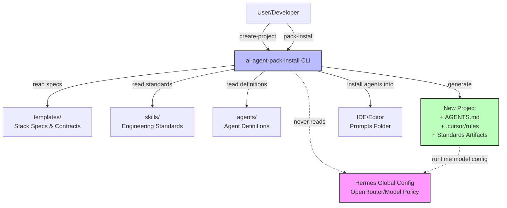
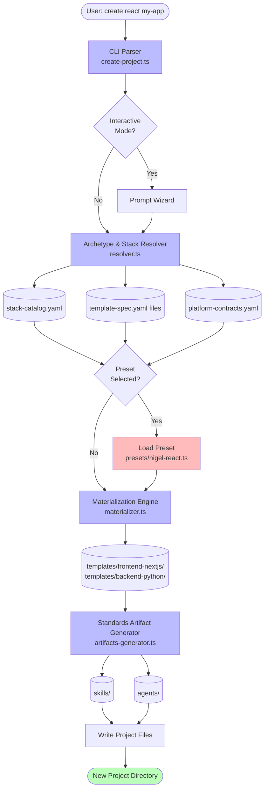
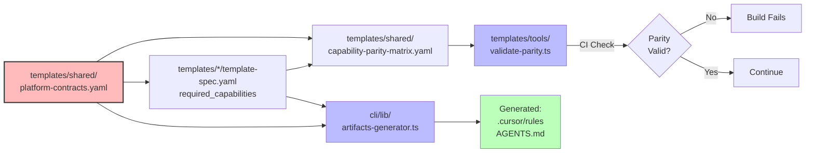

# Create-Project Architecture

## Overview

This document defines the architecture for evolving `ai-agent-workflows` from an installer of agents/templates/skills into a canonical project scaffolding system. The scaffolding capability (`create-project`) will create new projects from template contracts and specs while generating project-local standards artifacts that guide AI agents without runtime re-decisions.

### Key Principles

1. **Separation of Concerns**: Hermes global config owns provider/model routing policy. This repo owns project engineering standards, scaffolds, skills, and generated project-local rules.
2. **Reusable Base Platform**: Core scaffolding logic remains stack-agnostic and reusable.
3. **Opinionated Overlays**: Nigel-specific presets compose over base templates without forking the template system.
4. **Standards Alignment**: Template contracts, parity checks, and generated project rules stay synchronized through shared source-of-truth files.
5. **Backward Compatibility**: Existing install mode remains unchanged.

## System Context



**Key Boundary**: The CLI reads templates, skills, and agents from this repo but never reads or writes Hermes global config. Generated projects may reference Hermes at runtime for model routing, but scaffolding itself is config-agnostic.

## Core Architecture Components

The create-project capability requires five core components:

### 1. CLI Command Surface Extension
- **Responsibility**: Parse create-project commands and options
- **Location**: `cli/create-project.ts` (new), invoked from extended `cli/pack-install.ts`
- **Modes**: Interactive wizard and non-interactive flag-based
- **Key API**:
  - `ai-agent-pack-install create <archetype> <name> [options]`
  - `ai-agent-pack-install create` (interactive mode)

### 2. Archetype & Stack Resolver
- **Responsibility**: Map archetype + stack choices to concrete template specs
- **Location**: `cli/lib/resolver.ts` (new)
- **Inputs**: Archetype (react, api, fullstack, library), stack keys (nextjs, python, etc.)
- **Outputs**: Resolved spec paths, platform contracts, required capabilities
- **Data Sources**:
  - `templates/shared/stack-catalog.yaml`
  - `templates/{stack}/template-spec.yaml`
  - `templates/shared/platform-contracts.yaml`

### 3. Template Materialization Engine
- **Responsibility**: Generate project file tree from resolved specs
- **Location**: `cli/lib/materializer.ts` (new)
- **Inputs**: Resolved specs, project name, output path, selected options
- **Outputs**: Physical project directory with:
  - Source file structure
  - Configuration files (package.json, tsconfig.json, etc.)
  - CI/CD workflows
  - Environment templates
- **Logic**:
  - Copy static files from template directories
  - Render templates with project-specific values
  - Apply required capabilities from platform contracts

### 4. Standards Artifact Generator
- **Responsibility**: Generate project-local standards artifacts
- **Location**: `cli/lib/artifacts-generator.ts` (new)
- **Outputs**:
  - `AGENTS.md` - Project-specific agent manifest
  - `.cursor/rules` - Project-local rules referencing stack choices
  - Workspace skills (where appropriate)
  - Stack-specific conventions document
- **Key Principle**: Generated artifacts are derived from template data, not hardcoded strings

### 5. Preset/Overlay System
- **Responsibility**: Apply opinionated defaults over base templates
- **Location**: `cli/lib/presets/` (new directory)
- **Examples**:
  - `nigel-react.preset.ts` - React state/styling/testing defaults
  - `nigel-api.preset.ts` - API patterns and conventions
- **Composition**: Presets modify materialization context before generation, not after

## Data Flow Architecture



## Component Implementation Details

### Archetype & Stack Resolver

**Purpose**: Translate user choices into concrete template specifications.

**Algorithm**:
1. Parse archetype (react, api, fullstack, library)
2. Map archetype to stack categories (frontend, backend, both)
3. Resolve stack keys to template spec paths via `stack-catalog.yaml`
4. Load and merge relevant template specs
5. Validate required capabilities against platform contracts
6. Return resolution context with:
   - Primary stack spec(s)
   - Platform contracts
   - Required capabilities list
   - Environment templates
   - State management defaults (for frontend)

**Validation Rules**:
- Archetype must map to at least one stack
- Selected stack must exist in catalog
- Template spec file must exist and be valid YAML
- Required capabilities must be defined in platform contracts

**Example Resolution**:
```typescript
Input:  { archetype: 'react', projectName: 'my-app' }
Resolve:
  - stack-catalog.yaml → frontend.nextjs
  - Load templates/frontend-nextjs/template-spec.yaml
  - Load templates/shared/platform-contracts.yaml
  - Extract state_management: { server_state: 'TanStack Query', client_state: 'Zustand' }
  - Extract required_capabilities: [CAP-FF-001, CAP-REP-001, ...]
Output: ResolvedContext with complete spec and contracts
```

### Template Materialization Engine

**Purpose**: Generate physical project structure from resolved specifications.

**Materialization Phases**:

1. **Structure Phase** - Create directory tree
   - Map required routes to folder structure
   - Create feature folders for required capabilities
   - Generate config file locations

2. **Copy Phase** - Copy static template files
   - Base configuration files (package.json, tsconfig.json)
   - CI/CD workflows from `templates/shared/workflows/`
   - Environment templates (.env.example)

3. **Render Phase** - Generate templated files
   - Replace `{{projectName}}`, `{{stackKey}}`, etc.
   - Generate imports for selected state management
   - Create stub implementations for required capabilities

4. **Integration Phase** - Wire required integrations
   - Feature flag client adapter
   - Telemetry provider adapter
   - Correlation ID HTTP client

**Template Variables**:
```typescript
{
  projectName: string;
  stackKey: string;
  framework: string;
  stateManagement?: {
    serverState: string;
    clientState: string;
    formState: string;
  };
  requiredCapabilities: string[];
  requiredRoutes: string[];
  requiredIntegrations: string[];
}
```

**File Mapping Strategy**:
- Static files: Direct copy with path mapping
- Template files (*.template.*): Render and rename
- Capability stubs: Generate from capability contracts
- CI workflows: Copy from shared/, render with stack-specific commands

### Standards Artifact Generator

**Purpose**: Generate project-local guidance artifacts that make stack choices explicit.

**Artifact Types**:

#### 1. AGENTS.md
Project-specific agent manifest that declares:
- Which agents are available in this project
- Stack-specific agent configuration
- Handoff rules between agents
- References to workspace skills

**Generation Logic**:
```typescript
Generate AGENTS.md:
  - Include: orchestrator, stack-specific implementers, reviewer, tester
  - Reference: Stack key, state management choices
  - Embed: Links to workspace skills for this stack
  - Specify: Testing commands from ci_command_contract
```

#### 2. .cursor/rules
Project-local Cursor rules that encode:
- Selected stack conventions
- State management patterns (Zustand + TanStack Query for React)
- Testing framework (Vitest for Next.js)
- Required capabilities that must not drift

**Generation Logic**:
```typescript
Generate .cursor/rules:
  - Stack: {{framework}} ({{stackKey}})
  - State Management: Server state via {{serverState}}, Client state via {{clientState}}
  - Testing: Unit tests via {{unitTestCommand}}, E2E via {{e2eTestCommand}}
  - Required Capabilities: {{requiredCapabilities}} must remain implemented
  - Platform Contracts: Changes to reporting/feature-flags/admin APIs require template version bump
```

#### 3. Workspace Skills (Optional)
For stacks with skills, copy relevant skill families:
- `impl-nextjs` for Next.js projects
- `impl-python` for Python backend projects
- `test-backend-unit`, `test-frontend-unit` as appropriate

**Generation Logic**:
```typescript
Copy skills to .github/skills/:
  - Resolve required skill families from agent skill map
  - Filter by selected agents
  - Copy SKILL.md files maintaining structure
```

#### 4. Stack Conventions Document
Generated markdown documenting the chosen conventions:

```markdown
# Stack Conventions: {{projectName}}

## Stack
- Framework: {{framework}}
- Template: {{stackKey}}
- Generated: {{timestamp}}

## State Management
- Server State: {{serverState}}
- Client State: {{clientState}}
- Form State: {{formState}}

## Testing
- Unit: {{unitTestCommand}} via {{unitTestFramework}}
- E2E: {{e2eTestCommand}} via {{e2eTestMode}}

## Required Capabilities
{{#each requiredCapabilities}}
- {{this}}
{{/each}}

## Platform Contracts
This project implements the platform contracts defined in:
- templates/shared/platform-contracts.yaml version {{contractVersion}}

Changes to feature flags, reporting, or admin dashboard APIs must maintain contract compatibility.
```

### Preset/Overlay System

**Purpose**: Apply opinionated defaults without duplicating base template system.

**Preset Structure**:
```typescript
interface Preset {
  name: string;
  appliesTo: string[]; // stack keys: ['nextjs', 'sveltekit']
  
  modifyContext(ctx: MaterializationContext): MaterializationContext;
  
  additionalArtifacts?: {
    path: string;
    content: string;
  }[];
  
  packageDependencies?: {
    dependencies?: Record<string, string>;
    devDependencies?: Record<string, string>;
  };
}
```

**Example: Nigel React Preset**
```typescript
// cli/lib/presets/nigel-react.preset.ts
export const nigelReactPreset: Preset = {
  name: 'nigel-react',
  appliesTo: ['nextjs', 'sveltekit'],
  
  modifyContext(ctx) {
    return {
      ...ctx,
      stateManagement: {
        serverState: 'TanStack Query',
        clientState: 'Zustand',
        formState: 'React Hook Form + Zod',
      },
      styling: 'Tailwind CSS',
      testing: {
        unit: 'Vitest',
        e2e: 'Playwright',
      },
      additionalRules: [
        'Keep server state in query cache',
        'Keep UI state in feature-local Zustand stores',
        'Use React Hook Form for all forms',
        'Use Zod for validation schemas',
      ],
    };
  },
  
  packageDependencies: {
    dependencies: {
      '@tanstack/react-query': '^5.0.0',
      'zustand': '^5.0.0',
      'react-hook-form': '^7.0.0',
      'zod': '^3.0.0',
    },
    devDependencies: {
      'vitest': '^2.0.0',
      '@playwright/test': '^1.0.0',
    },
  },
};
```

**Preset Application Flow**:
1. User selects archetype + stack
2. Resolver identifies available presets for that stack
3. If interactive, prompt user to select preset
4. If selected, load preset module
5. Call `preset.modifyContext(baseContext)` before materialization
6. Materialization engine uses modified context
7. Standards generator includes preset decisions in artifacts

**Preset Composition Rules**:
- Presets modify context, not generated files directly
- Multiple presets can compose (e.g., nigel-react + nigel-tailwind)
- Base template remains canonical; presets are additive
- Preset changes don't require template spec updates

## Standards Alignment Strategy

**Challenge**: Keep template contracts, parity checks, and generated project rules synchronized as templates evolve.

**Solution**: Single source of truth with generated derivatives.

### Alignment Mechanism



### Alignment Rules

1. **Source of Truth**: `platform-contracts.yaml` defines all cross-cutting capabilities
2. **Template Declaration**: Each `template-spec.yaml` declares `required_capabilities` as references to platform contracts
3. **Parity Validation**: CI runs `validate-parity.ts` to ensure all required capabilities are implemented in template directories
4. **Generated Artifacts**: Standards artifacts are generated from the same source data (contracts + specs)
5. **Versioning**: Contract changes require template version bump (semver in spec files)

### Validation Workflow

**Existing** (`templates/tools/validate-parity.ts`):
- Validates that template directories implement required capabilities
- Checks that capability IDs in specs exist in contracts
- Ensures no capability drift between frontend/backend stacks

**Enhanced for create-project**:
- Validator runs in CI on every PR
- Generator reads validated specs (assumes validation passed)
- Generated project artifacts embed the validated contract version
- Projects can check if they're based on outdated contracts

### Traceability

Generated artifacts include traceability metadata:

```markdown
<!-- Generated by ai-agent-workflows v1.0.0 -->
<!-- Template: frontend-nextjs v1.0.0 -->
<!-- Contracts: platform-contracts.yaml v1.0.0 -->
<!-- Generated: 2026-09-15T19:24:00Z -->
```

This allows:
- Projects to identify which template version they're based on
- Future tooling to detect contract drift
- Regeneration of artifacts when templates update

## Integration Points

### CLI Integration

**Existing CLI** (`cli/pack-install.ts`):
- Entry point: `#!/usr/bin/env node`
- Parses args, runs install workflow
- Supports `--yes`, `--targets`, `--workspace`, etc.

**Enhanced CLI**:
```typescript
// cli/pack-install.ts (modified)
function parseArgs(argv: string[]): ParsedArgs {
  // Add:
  mode: 'install' | 'create';  // default 'install'
  createArchetype?: string;
  createProjectName?: string;
  createOutputPath?: string;
  createPreset?: string;
  // ... existing fields
}

// Route based on mode
if (args.mode === 'create') {
  await runCreate(args);  // new
} else {
  await runInstall(args);  // existing
}
```

**Command Examples**:
```bash
# Interactive create
ai-agent-pack-install create

# Non-interactive with archetype
ai-agent-pack-install create react my-app

# With preset
ai-agent-pack-install create react my-app --preset nigel-react

# With stack override (when archetype supports multiple stacks)
ai-agent-pack-install create frontend my-app --stack sveltekit

# Fullstack with both stacks
ai-agent-pack-install create fullstack my-project --frontend nextjs --backend python
```

### Template System Integration

**Existing**:
- Templates live in `templates/{stack}/`
- Each has `template-spec.yaml`
- Shared contracts in `templates/shared/`
- Parity validator ensures consistency

**Enhanced**:
- No changes to template structure
- Materialization engine reads existing template files
- New `templates/{stack}/scaffold/` directories (optional) for create-specific templates
- Scaffold templates override base templates when creating new projects

**Example**:
```
templates/frontend-nextjs/
  template-spec.yaml          (existing - used by both modes)
  .env.example                (existing - copied during install or create)
  scaffold/                   (new - create-specific files)
    package.json.template     (template with {{projectName}} variables)
    src/
      app/
        layout.tsx.template
        page.tsx.template
      features/
        reports/
          report-service.ts.template
```

### Skills Integration

**Existing**:
- Skills in `skills/{family}/SKILL.md`
- Install mode copies to workspace `.github/skills/`
- Agent skill map (`agent-skill-map.md`) defines dependencies

**Enhanced**:
- Create mode also copies relevant skills to `.github/skills/`
- Generated `AGENTS.md` references skills by path
- Skill selection based on archetype/stack (e.g., React projects get `impl-nextjs`)

### Agents Integration

**Existing**:
- Agents in `agents/*.agent.md`
- Install mode copies to IDE prompts folders

**Enhanced**:
- Create mode generates `AGENTS.md` manifest in project
- Manifest lists applicable agents for the stack
- Agents can reference project-local skills and rules

## Hermes Boundary (Provider/Model Config)

**Explicit Separation**:

### What This Repo Owns
✅ Project engineering standards (state management, testing, conventions)
✅ Template specifications (required capabilities, routes, integrations)
✅ Skills and agent definitions
✅ Generated project-local rules (`.cursor/rules`)

### What Hermes Owns
❌ OpenRouter API keys and credentials
❌ Model routing policy (which model for which task)
❌ Provider selection (OpenRouter, Anthropic, OpenAI, etc.)
❌ Model-specific parameters (temperature, max tokens, etc.)

### Boundary Enforcement

**In Templates**:
- No API keys or credentials in any template file
- No model names in template specs
- No provider configuration in scaffolds
- Templates may include placeholder comments about runtime config

**In Generated Projects**:
- No credentials in generated `.env.example` files
- Generated rules reference "the configured model" without naming specific models
- Documentation may link to Hermes setup instructions but not embed config

**Example - What's OK**:
```typescript
// Generated project file
import { openRouterClient } from '@/lib/openrouter';  // ✅ references client abstraction

// Runtime client configured via Hermes global config
const response = await openRouterClient.chat({ ... });  // ✅ uses runtime config
```

**Example - What's NOT OK**:
```typescript
// ❌ DO NOT EMBED in templates or generated projects:
const client = new OpenRouterClient({
  apiKey: 'sk-or-v1-...',          // ❌ credential
  defaultModel: 'anthropic/claude', // ❌ model policy
});
```

### Runtime Integration

Generated projects **may** reference Hermes at runtime:
1. Import Hermes client libraries (if available as npm packages)
2. Read Hermes config from global location at runtime
3. Include documentation on how to configure Hermes for the project

Generated projects **must not** embed:
1. Hermes configuration files
2. API keys or provider credentials
3. Model routing rules

## Extension Points for Future Work

### Archetype Extensibility

**Current**: Hardcoded archetypes (react, api, fullstack, library)

**Future**: Plugin-based archetype registry
```typescript
// cli/lib/archetypes/registry.ts
export interface ArchetypeDefinition {
  key: string;
  label: string;
  description: string;
  requiredStacks: ('frontend' | 'backend' | 'both')[];
  defaultStacks?: { frontend?: string; backend?: string };
  requiredCapabilities?: string[];
}

// Custom archetypes in cli/lib/archetypes/custom/
```

### Preset Extensibility

**Current**: Nigel-specific presets in `cli/lib/presets/`

**Future**: 
- User-defined presets in workspace `.ai-workflows/presets/`
- Preset discovery mechanism
- Preset composition rules for combining multiple presets

### Multi-Repo Standards Synchronization

**Current**: Out of scope

**Future**: Standards sync tool
- Detect projects created from this scaffolding
- Compare project's contract version vs current
- Offer to regenerate standards artifacts when contracts update
- Maintain project-specific customizations during sync

### Template Marketplace

**Current**: Templates bundled in repo

**Future**:
- External template repositories
- Template discovery and installation
- Community-contributed stacks
- Template versioning and compatibility checking

## Implementation Phasing

Recommend implementing in phases aligned with existing issues #32-#36:

### Phase 1: CLI Command Surface (#32)
- Extend `cli/pack-install.ts` with create mode
- Add argument parsing for archetypes and project options
- Interactive wizard for create mode
- Help text and validation

### Phase 2: Resolution & Materialization (#33)
- Implement `cli/lib/resolver.ts`
- Implement `cli/lib/materializer.ts`
- Template variable substitution
- File tree generation
- Basic validation and error handling

### Phase 3: Standards Artifact Generation (#34)
- Implement `cli/lib/artifacts-generator.ts`
- Generate `AGENTS.md`
- Generate `.cursor/rules`
- Copy workspace skills
- Generate stack conventions document

### Phase 4: Nigel React Preset (#35)
- Design preset system (`cli/lib/presets/`)
- Implement `nigel-react.preset.ts`
- Preset application in materialization flow
- Test preset composition

### Phase 5: Documentation & E2E Tests (#36)
- Update README with create-project examples
- Add focused scaffolding docs
- Implement E2E verification tests
- CI integration

## Success Criteria

### Functional Success
- ✅ User can run `ai-agent-pack-install create react my-app` and get a runnable Next.js project
- ✅ Generated project includes `AGENTS.md` with stack-specific agents
- ✅ Generated project includes `.cursor/rules` encoding state management and testing choices
- ✅ Nigel preset applies standardized React defaults (Zustand + TanStack Query + Tailwind)
- ✅ Template parity validation continues to pass in CI
- ✅ Existing install mode remains unchanged and functional

### Technical Success
- ✅ No Hermes config or API keys in repo or generated projects
- ✅ Generated artifacts traceable to template version
- ✅ Preset system composes over base templates without forking
- ✅ Template contracts remain single source of truth
- ✅ E2E tests verify at least React and API scaffolding paths

### Documentation Success
- ✅ README explains when to use install vs create modes
- ✅ Architecture doc (this document) maintained as implementation reference
- ✅ Backlog (#32-#36) updated if implementation reveals better task breakdown
- ✅ Generated projects include first-run instructions

## Conclusion

This architecture provides a clear path from the current install-focused CLI to a full project scaffolding system while preserving backward compatibility, maintaining standards alignment, and respecting the boundary with Hermes for provider/model configuration. The phased implementation plan aligns with existing issues #32-#36 and provides clear completion criteria for each phase.
