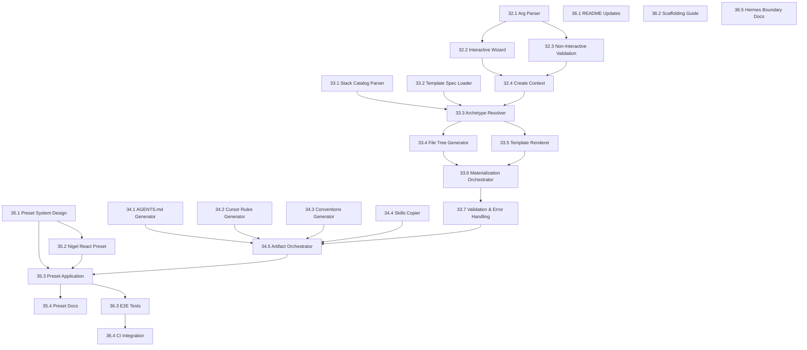

# Create-Project Implementation Backlog

## Overview

This backlog maps the create-project architecture to concrete implementation tasks. Tasks are organized to align with GitHub issues #32-#36, with separation between reusable base-platform work and Nigel-specific overlay work.

**Dependency Order**: #32 → #33 → #34 → #35 → #36

## Task Categories

- **Base Platform**: Reusable scaffolding infrastructure for any user
- **Nigel Overlay**: Nigel-specific presets and defaults
- **Infrastructure**: Testing, CI, documentation

---

## Issue #32: CLI Command Surface

**Epic**: Add `create-project` command surface to the CLI for scaffolding new projects

**Category**: Base Platform

### Task 32.1: Extend Argument Parser
**Component**: CLI

**Description**: Add create-mode arguments to existing CLI parser in `cli/pack-install.ts`

**Changes Required**:
```typescript
interface ParsedArgs {
  // Add:
  mode: 'install' | 'create';
  createArchetype?: string;
  createProjectName?: string;
  createOutputPath?: string;
  createStack?: string;
  createFrontendStack?: string;
  createBackendStack?: string;
  createPreset?: string;
  createSkipSkills?: boolean;
  // ... existing fields
}
```

**Implementation Steps**:
1. Add mode detection (positional 'create' command)
2. Parse create-specific flags (--archetype, --preset, etc.)
3. Validate create args (archetype required in non-interactive)
4. Add help text for create mode
5. Route to create handler based on mode

**Acceptance Criteria**:
- [ ] `ai-agent-pack-install create` parses without error
- [ ] `ai-agent-pack-install create react my-app` parses archetype and name
- [ ] `--preset` flag is recognized and parsed
- [ ] `--help` includes create-mode documentation
- [ ] Invalid archetype returns clear error message
- [ ] Existing install mode parsing is unaffected

**Tests**:
- [ ] Unit test: parse create command with all flags
- [ ] Unit test: parse create command with minimal args
- [ ] Unit test: validate archetype enum
- [ ] Unit test: help text includes create examples
- [ ] Regression test: install mode parsing unchanged

**Completion Checklist**:
- [ ] Code implemented in `cli/pack-install.ts`
- [ ] Help text updated with create examples
- [ ] Unit tests pass
- [ ] Manual test: `ai-agent-pack-install create --help`

---

### Task 32.2: Interactive Create Wizard
**Component**: CLI

**Description**: Build interactive prompt flow for create mode using `@inquirer/prompts`

**Prompt Flow**:
1. Select archetype (react, api, fullstack, library)
2. Enter project name
3. Select output path (default: cwd)
4. Select stack(s) based on archetype
   - Frontend archetypes: nextjs, sveltekit, angular
   - Backend archetypes: node_nestjs, python, go, dotnet, java, rust
   - Fullstack: both frontend and backend
5. Select preset (if available for stack)
6. Optional: Skip workspace skills
7. Confirm choices

**Implementation Steps**:
1. Create prompt helper functions
2. Build archetype selection with descriptions
3. Add project name input with validation
4. Add conditional stack selection based on archetype
5. Add preset selection (filtered by applicable stacks)
6. Add confirmation summary
7. Handle cancellation gracefully

**Acceptance Criteria**:
- [ ] Interactive wizard presents archetype choices
- [ ] Project name validates (no spaces, valid directory name)
- [ ] Stack choices are filtered by archetype
- [ ] Preset choices show only applicable presets for selected stack
- [ ] Summary shows all selections before confirmation
- [ ] ESC or Ctrl+C cancels without error
- [ ] Selections are returned as create context object

**Tests**:
- [ ] Integration test: mock prompts, verify returned context
- [ ] Unit test: archetype filtering logic
- [ ] Unit test: project name validation

**Completion Checklist**:
- [ ] Prompt flow implemented in `cli/create-project.ts` (new file)
- [ ] All prompts functional and tested
- [ ] Error handling for invalid inputs
- [ ] Cancellation handled gracefully
- [ ] Manual test: complete wizard end-to-end

---

### Task 32.3: Non-Interactive Mode Validation
**Component**: CLI

**Description**: Validate non-interactive create commands have required args

**Validation Rules**:
- Archetype is required
- Project name is required
- Output path defaults to cwd if not provided
- Stack defaults to preferred stack for archetype if not provided
- Fullstack archetype requires explicit --frontend and --backend OR uses defaults
- Invalid archetype/stack combinations fail with clear message

**Implementation Steps**:
1. Create validation function for non-interactive args
2. Define default stacks for each archetype
3. Build validation messages for missing required args
4. Build validation messages for invalid combinations
5. Return validated create context or exit with error

**Acceptance Criteria**:
- [ ] `create react my-app` succeeds with defaults
- [ ] `create my-app` fails with "archetype required" message
- [ ] `create invalid-archetype my-app` fails with "unknown archetype" message
- [ ] `create fullstack my-app` succeeds with default stacks
- [ ] `create fullstack my-app --frontend vue` fails with "unknown stack" message
- [ ] Validation errors include examples of valid values

**Tests**:
- [ ] Unit test: validate minimal valid args
- [ ] Unit test: validate missing archetype
- [ ] Unit test: validate invalid archetype
- [ ] Unit test: validate invalid stack
- [ ] Unit test: validate fullstack with partial stacks

**Completion Checklist**:
- [ ] Validation function implemented
- [ ] All validation tests pass
- [ ] Error messages are actionable
- [ ] Manual test: try invalid combinations

---

### Task 32.4: Create Context Object
**Component**: CLI / Shared Types

**Description**: Define TypeScript interface for create context passed to resolution and materialization

**Interface Definition**:
```typescript
// cli/lib/types.ts (new file)
export interface CreateContext {
  archetype: 'react' | 'api' | 'fullstack' | 'library';
  projectName: string;
  outputPath: string;
  stacks: {
    frontend?: string;  // e.g., 'nextjs'
    backend?: string;   // e.g., 'python'
  };
  preset?: string;      // e.g., 'nigel-react'
  options: {
    skipSkills: boolean;
    skipTemplates: boolean;
    dryRun: boolean;
  };
  // Populated by resolver:
  resolved?: ResolvedContext;
}

export interface ResolvedContext {
  specs: {
    frontend?: TemplateSpec;
    backend?: TemplateSpec;
  };
  contracts: PlatformContracts;
  requiredCapabilities: string[];
  stateManagement?: StateManagementConfig;
  ciCommands: CiCommandContract;
}
```

**Implementation Steps**:
1. Create `cli/lib/types.ts`
2. Define all context interfaces
3. Add JSDoc documentation
4. Export from `cli/lib/index.ts` (if created)

**Acceptance Criteria**:
- [ ] Types compile without errors
- [ ] All required fields are defined
- [ ] Optional fields are marked with `?`
- [ ] JSDoc explains each field's purpose
- [ ] Types are importable from other CLI modules

**Tests**:
- [ ] Type test: create valid context object
- [ ] Type test: resolved context extends create context

**Completion Checklist**:
- [ ] Types defined in `cli/lib/types.ts`
- [ ] Documentation complete
- [ ] Exported and importable
- [ ] Used by parser and validator

---

## Issue #33: Template Materialization Engine

**Epic**: Build engine that resolves archetypes/stacks and generates project files

**Category**: Base Platform

### Task 33.1: Stack Catalog Parser
**Component**: Template Resolution

**Description**: Parse `templates/shared/stack-catalog.yaml` into typed objects

**Implementation Steps**:
1. Create `cli/lib/stack-catalog.ts`
2. Define TypeScript interfaces for catalog structure
3. Implement YAML parser (use `yaml` package)
4. Validate catalog structure on load
5. Export accessor functions (getStackByKey, getFrontendStacks, etc.)

**Acceptance Criteria**:
- [ ] `loadStackCatalog()` returns typed catalog object
- [ ] `getStackByKey('nextjs')` returns frontend stack definition
- [ ] Missing stack key returns undefined or throws clear error
- [ ] Invalid YAML syntax is caught with clear error message
- [ ] Catalog validation checks required fields (key, framework, spec)

**Tests**:
- [ ] Unit test: load valid catalog
- [ ] Unit test: get stack by key
- [ ] Unit test: get all frontend stacks
- [ ] Unit test: get all backend stacks
- [ ] Unit test: handle missing stack key
- [ ] Unit test: validate required fields

**Completion Checklist**:
- [ ] Parser implemented in `cli/lib/stack-catalog.ts`
- [ ] All tests pass
- [ ] Types exported
- [ ] Manual test: load and query catalog

---

### Task 33.2: Template Spec Loader
**Component**: Template Resolution

**Description**: Load and parse individual `template-spec.yaml` files

**Implementation Steps**:
1. Create `cli/lib/template-spec.ts`
2. Define TypeScript interface for TemplateSpec
3. Implement loader function `loadTemplateSpec(specPath: string)`
4. Validate spec structure
5. Export accessor functions for spec fields

**Interface**:
```typescript
export interface TemplateSpec {
  version: string;
  template: string;
  purpose: string;
  framework: {
    name: string;
    rendering?: string;
    language: string;
  };
  state_management?: StateManagementConfig;
  required_capabilities: string[];
  required_routes: string[];
  required_integrations: string[];
  ci_command_contract: CiCommandContract;
  testing_starter: TestingConfig;
}
```

**Acceptance Criteria**:
- [ ] `loadTemplateSpec(path)` returns typed spec object
- [ ] Missing spec file throws clear error
- [ ] Invalid YAML is caught and reported
- [ ] Spec validation checks required fields
- [ ] Multiple specs can be loaded simultaneously

**Tests**:
- [ ] Unit test: load Next.js spec
- [ ] Unit test: load Python backend spec
- [ ] Unit test: handle missing file
- [ ] Unit test: validate required fields
- [ ] Unit test: extract state management config

**Completion Checklist**:
- [ ] Loader implemented in `cli/lib/template-spec.ts`
- [ ] All tests pass
- [ ] Types exported and documented
- [ ] Manual test: load multiple specs

---

### Task 33.3: Archetype Resolver
**Component**: Template Resolution

**Description**: Map archetype + stack choices to concrete template specs and contracts

**Implementation Steps**:
1. Create `cli/lib/resolver.ts`
2. Implement `resolveArchetype(ctx: CreateContext): ResolvedContext`
3. Load stack catalog
4. Map archetype to stack categories (frontend, backend, both)
5. Load relevant template specs
6. Load platform contracts
7. Merge required capabilities
8. Return resolved context

**Resolution Logic**:
```
Input: { archetype: 'react', stacks: { frontend: 'nextjs' } }

1. Load stack-catalog.yaml
2. Find frontend.nextjs entry
3. Load templates/frontend-nextjs/template-spec.yaml
4. Load templates/shared/platform-contracts.yaml
5. Extract state_management from spec
6. Extract required_capabilities from spec
7. Return ResolvedContext with all loaded data
```

**Acceptance Criteria**:
- [ ] `resolveArchetype({ archetype: 'react', ... })` returns resolved context
- [ ] Frontend archetype loads only frontend specs
- [ ] Backend archetype loads only backend specs
- [ ] Fullstack archetype loads both frontend and backend specs
- [ ] Invalid stack key throws clear error with available stacks
- [ ] Capabilities from both specs are merged (fullstack)

**Tests**:
- [ ] Unit test: resolve React archetype
- [ ] Unit test: resolve API archetype
- [ ] Unit test: resolve fullstack archetype
- [ ] Unit test: invalid stack throws error
- [ ] Unit test: capabilities merged for fullstack
- [ ] Integration test: end-to-end resolution for each archetype

**Completion Checklist**:
- [ ] Resolver implemented in `cli/lib/resolver.ts`
- [ ] All tests pass
- [ ] Error messages are actionable
- [ ] Manual test: resolve each archetype

---

### Task 33.4: File Tree Generator
**Component**: Materialization

**Description**: Generate project directory structure from resolved specs

**Implementation Steps**:
1. Create `cli/lib/file-tree.ts`
2. Implement `generateFileTree(resolved: ResolvedContext): FileTreeNode[]`
3. Map required routes to folder structure
4. Map required capabilities to feature folders
5. Generate standard directories (src, tests, config)
6. Return tree structure for materialization

**File Tree Structure**:
```typescript
interface FileTreeNode {
  type: 'directory' | 'file';
  path: string;
  template?: string;  // path to template file if applicable
  content?: string;   // direct content if generated
}

// Example output for React:
[
  { type: 'directory', path: 'src' },
  { type: 'directory', path: 'src/app' },
  { type: 'directory', path: 'src/features' },
  { type: 'directory', path: 'src/features/reports' },
  { type: 'file', path: 'src/app/layout.tsx', template: 'templates/frontend-nextjs/scaffold/src/app/layout.tsx.template' },
  // ...
]
```

**Acceptance Criteria**:
- [ ] Required routes map to route folders
- [ ] Required capabilities map to feature folders
- [ ] Standard directories are created (src, tests, public, etc.)
- [ ] CI config directories are included (.github/workflows)
- [ ] Template paths are resolved correctly

**Tests**:
- [ ] Unit test: generate tree for Next.js
- [ ] Unit test: generate tree for Python backend
- [ ] Unit test: fullstack generates both trees
- [ ] Unit test: required routes become directories

**Completion Checklist**:
- [ ] Generator implemented in `cli/lib/file-tree.ts`
- [ ] All tests pass
- [ ] Tree structure documented
- [ ] Manual test: inspect generated tree

---

### Task 33.5: Template Renderer
**Component**: Materialization

**Description**: Render template files with variable substitution

**Implementation Steps**:
1. Create `cli/lib/renderer.ts`
2. Implement simple template variable substitution
3. Support basic conditionals (if stack === 'nextjs')
4. Support loops (for each capability)
5. Implement `renderTemplate(templatePath, variables): string`

**Template Variables**:
```typescript
interface TemplateVariables {
  projectName: string;
  stackKey: string;
  framework: string;
  stateManagement?: {
    serverState: string;
    clientState: string;
    formState: string;
  };
  requiredCapabilities: string[];
  requiredRoutes: string[];
  requiredIntegrations: string[];
  timestamp: string;
}
```

**Template Syntax** (simple Mustache-style):
```typescript
// {{projectName}} - simple substitution
// {{#if stateManagement}} - conditional
// {{#each requiredCapabilities}} - loop
```

**Acceptance Criteria**:
- [ ] `renderTemplate(path, vars)` substitutes all variables
- [ ] Conditionals work (if, unless)
- [ ] Loops work (each)
- [ ] Missing variables throw clear error
- [ ] Extra variables are ignored (no error)

**Tests**:
- [ ] Unit test: simple substitution
- [ ] Unit test: conditional rendering
- [ ] Unit test: loop rendering
- [ ] Unit test: missing variable error
- [ ] Integration test: render real template file

**Completion Checklist**:
- [ ] Renderer implemented in `cli/lib/renderer.ts`
- [ ] Template syntax documented
- [ ] All tests pass
- [ ] Manual test: render sample template

---

### Task 33.6: Materialization Orchestrator
**Component**: Materialization

**Description**: Orchestrate file tree generation and template rendering to produce physical project

**Implementation Steps**:
1. Create `cli/lib/materializer.ts`
2. Implement `materializeProject(ctx: CreateContext): Promise<void>`
3. Call resolver to get resolved context
4. Generate file tree from resolved context
5. For each file node:
   - If template: load, render, write
   - If copy: copy file
   - If generated: write content directly
6. Create all directories
7. Write all files
8. Handle errors and rollback on failure

**Phases**:
1. **Resolve** - Get resolved context
2. **Plan** - Generate file tree
3. **Prepare** - Create all directories
4. **Materialize** - Render and write all files
5. **Verify** - Check all expected files exist

**Acceptance Criteria**:
- [ ] Materialization creates project directory
- [ ] All directories are created before files
- [ ] Template files are rendered and written
- [ ] Static files are copied
- [ ] Environment files (.env.example) are included
- [ ] CI workflows are copied from shared/workflows/
- [ ] Errors during materialization are handled gracefully
- [ ] Partial failures are rolled back (optional: implement)

**Tests**:
- [ ] Integration test: materialize Next.js project
- [ ] Integration test: materialize Python API project
- [ ] Integration test: materialize fullstack project
- [ ] Unit test: error handling during file write
- [ ] Unit test: directory creation order

**Completion Checklist**:
- [ ] Orchestrator implemented in `cli/lib/materializer.ts`
- [ ] All phases documented
- [ ] Error handling complete
- [ ] Integration tests pass
- [ ] Manual test: create real project, verify structure

---

### Task 33.7: Validation and Error Handling
**Component**: Materialization

**Description**: Add validation and clear error messages throughout materialization

**Validation Points**:
1. Output directory exists or is creatable
2. Output directory is empty or user confirms overwrite
3. Template files exist at expected paths
4. Required template variables are provided
5. Generated project structure matches spec

**Error Messages**:
- "Output directory '/path' already exists and is not empty. Use --force to overwrite."
- "Template file not found: templates/frontend-nextjs/scaffold/layout.tsx.template"
- "Missing required variable: projectName"
- "Stack 'invalid' not found. Available: nextjs, sveltekit, angular"

**Implementation Steps**:
1. Add validation functions for each phase
2. Implement clear error messages
3. Add --force flag for overwrite
4. Add --dry-run for preview
5. Log progress during materialization

**Acceptance Criteria**:
- [ ] Non-empty output directory is rejected (unless --force)
- [ ] Missing template files are reported clearly
- [ ] Missing variables are reported with variable name
- [ ] Invalid stacks list available options
- [ ] --dry-run shows what would be created without writing files
- [ ] Progress is logged during materialization

**Tests**:
- [ ] Unit test: non-empty directory validation
- [ ] Unit test: missing template file error
- [ ] Unit test: missing variable error
- [ ] Integration test: dry-run produces no files

**Completion Checklist**:
- [ ] All validation implemented
- [ ] Error messages are actionable
- [ ] --dry-run works
- [ ] --force works
- [ ] Tests pass
- [ ] Manual test: trigger each error condition

---

## Issue #34: Standards Artifact Generation

**Epic**: Generate project-local standards artifacts (AGENTS.md, .cursor/rules, skills)

**Category**: Base Platform

### Task 34.1: AGENTS.md Generator
**Component**: Artifact Generation

**Description**: Generate project-specific agent manifest

**Content Structure**:
```markdown
# Project Agents: {{projectName}}

Generated by ai-agent-workflows v{{version}}
Template: {{stackKey}} v{{templateVersion}}
Generated: {{timestamp}}

## Available Agents

### Orchestrator
- Role: Project coordination and task breakdown
- Trigger: Start of new feature or complex task
- Skills: requirements-clarification, architecture-planning
- Handoff: Delegates to implementers

### Stack Implementer ({{framework}})
- Role: Implementation for {{framework}} stack
- Trigger: Handoff from orchestrator with implementation plan
- Skills: impl-{{stackKey}}, test-{{stackKey}}-unit
- Patterns: 
  - State: {{stateManagement}}
  - Testing: {{testingFramework}}

### Code Reviewer
- Role: Review implementations for quality and standards
- Trigger: Implementation complete, ready for review
- Skills: code-review, quality-assurance

### Tester
- Role: Write and run tests
- Trigger: Implementation complete or test failures
- Skills: test-backend-unit, test-frontend-unit
- Commands:
  - Unit: {{unitTestCommand}}
  - E2E: {{e2eTestCommand}}

## Stack Conventions

- Framework: {{framework}}
- State Management: {{stateManagement}}
- Testing: {{testingFramework}}

## Required Capabilities

{{#each requiredCapabilities}}
- {{this}}
{{/each}}

## Workspace Skills

Skills are available at `.github/skills/{{family}}/SKILL.md`

Installed families:
{{#each installedSkillFamilies}}
- {{this}}
{{/each}}
```

**Implementation Steps**:
1. Create `cli/lib/agents-generator.ts`
2. Load agent definitions from `agents/` directory
3. Filter agents by stack (e.g., only Next.js implementer for React projects)
4. Render template with resolved context
5. Write to `<project>/AGENTS.md`

**Acceptance Criteria**:
- [ ] Generated AGENTS.md includes orchestrator
- [ ] Stack-specific implementer is included
- [ ] Generic agents (reviewer, tester) are included
- [ ] State management conventions are listed
- [ ] Testing commands are listed
- [ ] Skill families are listed
- [ ] Template version traceability is included

**Tests**:
- [ ] Unit test: generate AGENTS.md for Next.js
- [ ] Unit test: generate AGENTS.md for Python API
- [ ] Integration test: generated file is valid markdown
- [ ] Integration test: generated file includes all expected sections

**Completion Checklist**:
- [ ] Generator implemented
- [ ] Template tested with all stacks
- [ ] Tests pass
- [ ] Manual test: read generated AGENTS.md

---

### Task 34.2: Cursor Rules Generator
**Component**: Artifact Generation

**Description**: Generate `.cursor/rules` encoding stack choices and conventions

**Content Structure**:
```markdown
# Cursor Rules: {{projectName}}

Generated by ai-agent-workflows
Template: {{stackKey}} v{{templateVersion}}
Contracts: platform-contracts.yaml v{{contractVersion}}

## Stack
- Framework: {{framework}} ({{stackKey}})
- Language: {{language}}
- Template Version: {{templateVersion}}

## State Management (Frontend)
- Server State: {{serverState}}
  - Keep server state in query cache
  - Use {{serverState}} hooks for API data
- Client State: {{clientState}}
  - Keep UI state in feature-local stores
  - Avoid global state for feature-specific UI
- Form State: {{formState}}
  - Use {{formState}} for all forms
  - Use validation schemas

## Testing
- Unit Tests: `{{unitTestCommand}}` via {{unitTestFramework}}
- E2E Tests: `{{e2eTestCommand}}` via {{e2eTestFramework}}
- Coverage: Target 80%+ for new code

## Required Capabilities
The following platform capabilities must remain implemented:
{{#each requiredCapabilities}}
- {{this}}
{{/each}}

Changes to these capabilities must maintain contract compatibility (see templates/shared/platform-contracts.yaml).

## Code Patterns
- Imports: Always at top of file, no inline imports
- Naming: Descriptive variable names, verb-first function names
- Error Handling: Use correlation IDs for all errors
- Observability: Emit telemetry for all key operations

## Platform Contracts
This project implements:
- Feature Flags API (CAP-FF-*)
- Reporting API (CAP-REP-*)
- Admin Dashboard (CAP-ADM-*)

Contract changes require template version bump.
```

**Implementation Steps**:
1. Create `cli/lib/cursor-rules-generator.ts`
2. Load platform contracts
3. Extract contract version
4. Render rules template with resolved context
5. Write to `<project>/.cursor/rules`

**Acceptance Criteria**:
- [ ] Generated rules include stack identification
- [ ] State management patterns are explicit
- [ ] Testing commands are listed
- [ ] Required capabilities are enumerated
- [ ] Contract version is traceable
- [ ] Code patterns section includes key conventions

**Tests**:
- [ ] Unit test: generate rules for Next.js
- [ ] Unit test: generate rules for Python API
- [ ] Unit test: fullstack generates both frontend and backend rules
- [ ] Integration test: generated file is valid

**Completion Checklist**:
- [ ] Generator implemented
- [ ] Template tested with all stacks
- [ ] Tests pass
- [ ] Manual test: read generated .cursor/rules

---

### Task 34.3: Stack Conventions Document Generator
**Component**: Artifact Generation

**Description**: Generate detailed conventions document for the stack

**Content Structure**:
```markdown
# Stack Conventions: {{projectName}}

## Overview
This document defines the engineering conventions for this {{framework}} project.
Generated: {{timestamp}}

## Technology Stack
- Framework: {{framework}}
- Language: {{language}}
- State Management: {{stateManagement}}
- Testing: {{testing}}
- Styling: {{styling}}
- Build Tool: {{buildTool}}

## Project Structure
\```
src/
  app/           # Routes and layouts
  features/      # Feature-based modules
  lib/           # Shared utilities
  components/    # Shared UI components
tests/
  unit/          # Unit tests
  e2e/           # End-to-end tests
\```

## State Management Patterns

### Server State
- Tool: {{serverState}}
- Location: Feature-level hooks (e.g., src/features/reports/use-reports.ts)
- Pattern: Query hooks for reads, mutation hooks for writes

### Client State
- Tool: {{clientState}}
- Location: Feature-level stores (e.g., src/features/reports/report-store.ts)
- Pattern: Slice-based stores, single responsibility

## Testing Conventions
- Unit: Test business logic and utilities
- Integration: Test feature modules with mocked dependencies
- E2E: Test critical user journeys

Commands:
- Unit: `{{unitTestCommand}}`
- E2E: `{{e2eTestCommand}}`

## Required Capabilities
This project must maintain implementations for:
{{#each requiredCapabilities}}
- {{this}}: {{capabilityDescription}}
{{/each}}

See `templates/shared/platform-contracts.yaml` for API contracts.

## Code Style
- Naming: Use descriptive names (getUserById, not getData)
- Imports: Top of file, no inline imports
- Exports: Explicit exports, no export * unless necessary
- Comments: Explain why, not what
```

**Implementation Steps**:
1. Create `cli/lib/conventions-generator.ts`
2. Load resolved context
3. Render conventions template
4. Include capability descriptions from platform contracts
5. Write to `<project>/docs/conventions.md`

**Acceptance Criteria**:
- [ ] Generated document includes all stack details
- [ ] State management section is specific to stack
- [ ] Testing section includes commands
- [ ] Required capabilities are explained
- [ ] Project structure is documented

**Tests**:
- [ ] Unit test: generate conventions for Next.js
- [ ] Unit test: generate conventions for Python API
- [ ] Integration test: generated file is valid markdown

**Completion Checklist**:
- [ ] Generator implemented
- [ ] Template complete
- [ ] Tests pass
- [ ] Manual test: read generated conventions

---

### Task 34.4: Workspace Skills Copier
**Component**: Artifact Generation

**Description**: Copy relevant skill families to project `.github/skills/`

**Implementation Steps**:
1. Create `cli/lib/skills-copier.ts`
2. Determine required skill families based on stack
   - React projects: impl-nextjs, test-frontend-unit, test-e2e
   - Python projects: impl-python, test-backend-unit
3. Copy skill SKILL.md files maintaining structure
4. Generate skills index file

**Skill Selection Logic**:
```typescript
function getRequiredSkills(stack: string): string[] {
  const skillMap = {
    nextjs: ['impl-nextjs', 'test-frontend-unit', 'test-e2e'],
    sveltekit: ['impl-sveltekit', 'test-frontend-unit', 'test-e2e'],
    python: ['impl-python', 'test-backend-unit'],
    go: ['impl-go', 'test-backend-unit'],
    // ...
  };
  return skillMap[stack] ?? [];
}
```

**Acceptance Criteria**:
- [ ] Skills are copied to `.github/skills/{family}/SKILL.md`
- [ ] Only relevant skills for stack are included
- [ ] Skill family structure is preserved
- [ ] Skills index is generated
- [ ] Option to skip skills (--skip-skills) works

**Tests**:
- [ ] Unit test: get required skills for Next.js
- [ ] Unit test: get required skills for Python
- [ ] Integration test: copy skills to project
- [ ] Integration test: verify file structure

**Completion Checklist**:
- [ ] Copier implemented
- [ ] Skill mapping complete for all stacks
- [ ] Tests pass
- [ ] Manual test: inspect copied skills

---

### Task 34.5: Artifact Generation Orchestrator
**Component**: Artifact Generation

**Description**: Orchestrate generation of all standards artifacts

**Implementation Steps**:
1. Create `cli/lib/artifacts-generator.ts`
2. Implement `generateArtifacts(ctx: CreateContext, projectPath: string)`
3. Call each generator in sequence:
   - Generate AGENTS.md
   - Generate .cursor/rules
   - Generate conventions document
   - Copy workspace skills (if not skipped)
4. Log progress
5. Handle errors

**Acceptance Criteria**:
- [ ] All artifacts are generated in single orchestration call
- [ ] Progress is logged for each artifact
- [ ] Errors in one generator don't prevent others
- [ ] Generated artifacts are consistent (same timestamp, version references)
- [ ] Skip flags are respected

**Tests**:
- [ ] Integration test: generate all artifacts for Next.js
- [ ] Integration test: generate all artifacts for Python
- [ ] Unit test: skip skills flag works
- [ ] Unit test: error in one generator is handled

**Completion Checklist**:
- [ ] Orchestrator implemented
- [ ] All generators integrated
- [ ] Tests pass
- [ ] Manual test: generate all artifacts for sample project

---

## Issue #35: Nigel React Preset

**Epic**: Add Nigel-specific preset for standardized React defaults

**Category**: Nigel Overlay

### Task 35.1: Preset System Design
**Component**: Preset Infrastructure

**Description**: Design and implement preset system for overlaying opinions

**Interface**:
```typescript
// cli/lib/presets/types.ts
export interface Preset {
  name: string;
  label: string;
  description: string;
  appliesTo: string[];  // stack keys
  
  modifyContext(ctx: CreateContext): CreateContext;
  
  additionalPackages?: {
    dependencies?: Record<string, string>;
    devDependencies?: Record<string, string>;
  };
  
  additionalFiles?: {
    path: string;
    content: string;
  }[];
  
  additionalRules?: string[];
}

// cli/lib/presets/registry.ts
export interface PresetRegistry {
  presets: Preset[];
}

export function loadPresetRegistry(): PresetRegistry;
export function getPreset(name: string): Preset | undefined;
export function getPresetsForStack(stackKey: string): Preset[];
```

**Implementation Steps**:
1. Create preset types
2. Create preset registry
3. Implement preset loader
4. Implement preset filter (by stack)
5. Document preset authoring

**Acceptance Criteria**:
- [ ] Preset interface is defined
- [ ] Registry can load multiple presets
- [ ] Presets can be filtered by applicable stack
- [ ] Preset.modifyContext transforms create context
- [ ] Additional packages are merged into package.json
- [ ] Additional rules are appended to .cursor/rules

**Tests**:
- [ ] Unit test: load preset registry
- [ ] Unit test: get preset by name
- [ ] Unit test: filter presets by stack
- [ ] Unit test: modify context with preset

**Completion Checklist**:
- [ ] Types defined
- [ ] Registry implemented
- [ ] Tests pass
- [ ] Documentation written

---

### Task 35.2: Nigel React Preset Implementation
**Component**: Preset / Nigel Overlay

**Description**: Implement first Nigel-specific preset for React stack

**Preset Definition**:
```typescript
// cli/lib/presets/nigel-react.preset.ts
export const nigelReactPreset: Preset = {
  name: 'nigel-react',
  label: 'Nigel React Standard',
  description: 'Opinionated React defaults: Zustand, TanStack Query, Tailwind, Vitest, Playwright',
  appliesTo: ['nextjs', 'sveltekit'],
  
  modifyContext(ctx) {
    return {
      ...ctx,
      stateManagement: {
        serverState: 'TanStack Query',
        clientState: 'Zustand',
        formState: 'React Hook Form + Zod',
      },
      styling: 'Tailwind CSS',
      testing: {
        unit: 'Vitest',
        e2e: 'Playwright',
      },
    };
  },
  
  additionalPackages: {
    dependencies: {
      '@tanstack/react-query': '^5.0.0',
      'zustand': '^5.0.0',
      'react-hook-form': '^7.0.0',
      'zod': '^3.0.0',
      'tailwindcss': '^3.0.0',
    },
    devDependencies: {
      'vitest': '^2.0.0',
      '@playwright/test': '^1.0.0',
    },
  },
  
  additionalRules: [
    '## Nigel React Standard',
    '- Server state: TanStack Query only (no Redux, no Context for server data)',
    '- Client state: Zustand stores, feature-scoped',
    '- Forms: React Hook Form + Zod validation',
    '- Styling: Tailwind utility classes (no CSS modules)',
    '- Testing: Vitest for unit, Playwright for E2E',
  ],
};
```

**Implementation Steps**:
1. Create `cli/lib/presets/nigel-react.preset.ts`
2. Define preset with all defaults
3. Register in preset registry
4. Add preset to interactive wizard choices
5. Add preset to non-interactive --preset flag

**Acceptance Criteria**:
- [ ] Preset is registered and discoverable
- [ ] Preset appears in interactive wizard for Next.js projects
- [ ] `create react my-app --preset nigel-react` applies preset
- [ ] Generated package.json includes preset dependencies
- [ ] Generated .cursor/rules includes preset rules
- [ ] State management defaults match preset

**Tests**:
- [ ] Unit test: preset is loadable
- [ ] Unit test: preset modifies context correctly
- [ ] Integration test: create project with preset
- [ ] Integration test: verify preset packages in package.json
- [ ] Integration test: verify preset rules in .cursor/rules

**Completion Checklist**:
- [ ] Preset implemented
- [ ] Registered in registry
- [ ] CLI integration complete
- [ ] Tests pass
- [ ] Manual test: create project with preset

---

### Task 35.3: Preset Application in Materialization
**Component**: Materialization / Preset Integration

**Description**: Integrate preset application into materialization flow

**Flow**:
1. User selects preset (or no preset)
2. After resolution, before materialization:
   - Load preset
   - Call preset.modifyContext(createContext)
   - Use modified context for materialization
3. After base materialization:
   - Merge preset.additionalPackages into package.json
   - Append preset.additionalRules to .cursor/rules
   - Write any preset.additionalFiles

**Implementation Steps**:
1. Modify materializer to check for preset
2. Apply preset modifications before tree generation
3. Merge preset packages during package.json generation
4. Append preset rules during rules generation
5. Write additional preset files

**Acceptance Criteria**:
- [ ] Preset context modifications affect materialization
- [ ] Preset packages appear in generated package.json
- [ ] Preset rules appear in generated .cursor/rules
- [ ] Preset additional files are written
- [ ] No preset selected works (no-op)

**Tests**:
- [ ] Integration test: materialize with preset
- [ ] Integration test: materialize without preset
- [ ] Unit test: merge preset packages
- [ ] Unit test: append preset rules

**Completion Checklist**:
- [ ] Integration implemented
- [ ] Tests pass
- [ ] Manual test: compare with/without preset

---

### Task 35.4: Preset Documentation
**Component**: Documentation / Nigel Overlay

**Description**: Document how to use and author presets

**Documentation Sections**:
1. **Using Presets**
   - How to list available presets
   - How to select preset interactively
   - How to specify preset non-interactively
   - What presets affect

2. **Available Presets**
   - Nigel React Standard
   - (Future presets)

3. **Authoring Presets**
   - Preset interface
   - How to register a preset
   - Best practices for presets
   - Testing presets

**Files to Create/Update**:
- `docs/presets.md` (new)
- Update `README.md` with preset examples
- Update `docs/create-project-architecture.md` with preset section

**Acceptance Criteria**:
- [ ] Preset usage is documented
- [ ] Available presets are listed
- [ ] Preset authoring guide exists
- [ ] README includes preset examples

**Completion Checklist**:
- [ ] Documentation written
- [ ] README updated
- [ ] Examples provided
- [ ] Manual review: docs are clear

---

## Issue #36: Documentation & E2E Tests

**Epic**: Document scaffolding workflow and add E2E verification

**Category**: Infrastructure

### Task 36.1: README Updates
**Component**: Documentation

**Description**: Update README with create-project examples and usage

**Sections to Add**:
1. **Scaffolding Projects** (new section)
   - Overview of create-project mode
   - When to use create vs install
   - Quick examples

2. **Examples**
   - Create React app
   - Create API service
   - Create fullstack app
   - Use preset

3. **CLI Reference**
   - Create-mode flags
   - Interactive vs non-interactive

**Implementation Steps**:
1. Add "Scaffolding Projects" section after "Getting Started"
2. Add command examples with expected output
3. Update CLI reference table
4. Update "What's left to reach the goal" checklist

**Acceptance Criteria**:
- [ ] README includes create-project overview
- [ ] Examples cover all archetypes
- [ ] Preset usage is shown
- [ ] CLI flags are documented
- [ ] Screenshots or example output included (optional)

**Completion Checklist**:
- [ ] README updated
- [ ] Examples tested manually
- [ ] Links verified
- [ ] Reviewed for clarity

---

### Task 36.2: Focused Scaffolding Documentation
**Component**: Documentation

**Description**: Create detailed scaffolding documentation

**File**: `docs/scaffolding-guide.md`

**Content**:
1. **Introduction**
   - What is scaffolding mode
   - vs install mode
   - Hermes boundary

2. **Getting Started**
   - Installation
   - First project
   - Understanding generated files

3. **Archetypes**
   - React (frontend)
   - API (backend)
   - Fullstack
   - Library (future)

4. **Stacks**
   - Available frontend stacks
   - Available backend stacks
   - Stack-specific conventions

5. **Presets**
   - What presets do
   - Available presets
   - When to use vs not use

6. **Generated Artifacts**
   - AGENTS.md
   - .cursor/rules
   - conventions.md
   - Workspace skills

7. **Template System**
   - How templates work
   - Template contracts
   - Parity validation

8. **Customization**
   - Post-generation changes
   - Adding capabilities
   - Maintaining standards alignment

9. **Troubleshooting**
   - Common errors
   - Validation failures
   - Missing templates

**Acceptance Criteria**:
- [ ] Guide covers all create-project features
- [ ] Examples for each archetype
- [ ] Troubleshooting section is helpful
- [ ] Hermes boundary is explained
- [ ] Links to architecture doc

**Completion Checklist**:
- [ ] Guide written
- [ ] Examples verified
- [ ] Screenshots added (optional)
- [ ] Reviewed for completeness

---

### Task 36.3: E2E Verification Tests
**Component**: Testing / Infrastructure

**Description**: Add automated E2E tests for scaffolding workflow

**Test Cases**:
1. **Create React Project**
   - Run create command for React
   - Verify project structure
   - Verify package.json
   - Verify AGENTS.md exists
   - Verify .cursor/rules exists
   - Verify npm install succeeds
   - Verify tests run

2. **Create API Project**
   - Run create command for API
   - Verify project structure
   - Verify dependencies
   - Verify artifacts generated

3. **Create Fullstack Project**
   - Run create command for fullstack
   - Verify both frontend and backend
   - Verify monorepo structure (if applicable)

4. **Create with Preset**
   - Run create with nigel-react preset
   - Verify preset packages
   - Verify preset rules

**Implementation Steps**:
1. Create `cli/e2e/` directory
2. Create test harness for running CLI
3. Implement each test case
4. Add cleanup (delete test projects)
5. Add to npm scripts

**Test Structure**:
```typescript
// cli/e2e/create-react.test.ts
import { runCLI, verifyProject } from './test-utils.ts';

test('create React project', async () => {
  const projectPath = await runCLI(['create', 'react', 'test-app', '--yes']);
  
  await verifyProject(projectPath, {
    files: [
      'package.json',
      'AGENTS.md',
      '.cursor/rules',
      'src/app/layout.tsx',
    ],
    packageDependencies: ['next', 'react'],
  });
  
  // Verify npm install works
  await runCommand('npm install', { cwd: projectPath });
  
  // Cleanup
  await fs.rm(projectPath, { recursive: true });
});
```

**Acceptance Criteria**:
- [ ] E2E test for each archetype
- [ ] Tests verify file structure
- [ ] Tests verify generated content
- [ ] Tests verify npm/pip install succeeds
- [ ] Tests cleanup after themselves
- [ ] Tests run in CI

**Tests**:
- [ ] E2E: create React project
- [ ] E2E: create API project
- [ ] E2E: create fullstack project
- [ ] E2E: create with preset
- [ ] E2E: error handling (invalid archetype)

**Completion Checklist**:
- [ ] E2E tests implemented
- [ ] Tests pass locally
- [ ] Added to npm scripts
- [ ] Added to CI workflow
- [ ] Cleanup verified

---

### Task 36.4: CI Integration
**Component**: CI/CD / Infrastructure

**Description**: Add create-project tests to CI pipeline

**Changes Required**:
1. Add E2E test job to `.github/workflows/ci-pr.yaml`
2. Ensure E2E tests run on all PRs
3. Cache dependencies for faster runs
4. Report test results

**CI Job**:
```yaml
e2e-scaffold:
  runs-on: ubuntu-latest
  steps:
    - uses: actions/checkout@v4
    - uses: actions/setup-node@v4
      with:
        node-version: '20'
        cache: 'npm'
    - run: npm ci
    - run: npm run e2e:scaffold
    - name: Upload test results
      if: failure()
      uses: actions/upload-artifact@v4
      with:
        name: e2e-results
        path: cli/e2e/results/
```

**Implementation Steps**:
1. Update CI workflow
2. Add npm script `e2e:scaffold`
3. Configure test timeout for CI
4. Test CI job on PR

**Acceptance Criteria**:
- [ ] E2E tests run in CI on every PR
- [ ] Test failures block PR merge
- [ ] Test results are reported
- [ ] CI runs complete in reasonable time (<10 min)

**Completion Checklist**:
- [ ] CI workflow updated
- [ ] npm script added
- [ ] CI job tested
- [ ] Verified on PR

---

### Task 36.5: Hermes Boundary Documentation
**Component**: Documentation

**Description**: Clearly document separation between this repo and Hermes

**File**: Update `docs/create-project-architecture.md` and add `docs/hermes-boundary.md`

**Content for hermes-boundary.md**:
1. **Overview**
   - What Hermes is
   - What this repo is
   - Why they're separate

2. **What This Repo Owns**
   - Engineering standards
   - Template specifications
   - Agent definitions
   - Skills
   - Project scaffolding

3. **What Hermes Owns**
   - Provider/model configuration
   - API keys and credentials
   - Model routing policy
   - Runtime model parameters

4. **Integration Points**
   - Generated projects can reference Hermes
   - Projects include Hermes client imports (if available)
   - No Hermes config embedded in templates

5. **Examples**
   - OK: Import Hermes client library
   - OK: Document how to configure Hermes
   - NOT OK: Embed API keys
   - NOT OK: Hardcode model names

**Acceptance Criteria**:
- [ ] Boundary is clearly defined
- [ ] Examples show what's OK and not OK
- [ ] Integration points are explained
- [ ] Documentation is linked from README

**Completion Checklist**:
- [ ] Documentation written
- [ ] Reviewed for clarity
- [ ] Linked from README and architecture doc

---

## Summary of Work Separation

### Base Platform (Reusable)
- CLI command surface (#32)
- Template resolution (#33.1-33.3)
- Materialization engine (#33.4-33.7)
- Standards artifact generation (#34)
- E2E tests and CI (#36)

### Nigel Overlay (Specific)
- Nigel React preset (#35)
- Preset system (enables future presets) (#35.1)

### Infrastructure
- Documentation (#36)
- Testing (#36.3)
- CI integration (#36.4)

---

## Completion Criteria

### Per-Task Completion
Each task is complete when:
- [ ] Code implemented and committed
- [ ] Unit tests pass (if applicable)
- [ ] Integration tests pass (if applicable)
- [ ] Manual testing verified
- [ ] Code reviewed (if team context)
- [ ] Documentation updated

### Per-Issue Completion
Each issue (#32-#36) is complete when:
- [ ] All tasks for that issue are complete
- [ ] Acceptance criteria from issue are met
- [ ] E2E verification (where applicable)
- [ ] Committed and pushed to branch
- [ ] PR created

### Overall Completion
The create-project feature is complete when:
- [ ] All issues #32-#36 are closed
- [ ] Architecture acceptance criteria met
- [ ] User can scaffold React, API, and fullstack projects
- [ ] Generated projects are runnable
- [ ] CI passes with E2E tests
- [ ] Documentation is complete and published

---

## Appendix: Task Dependencies


