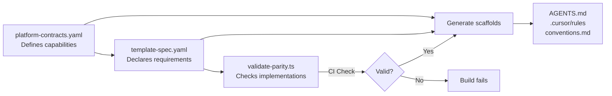

# Scaffolding Guide

## Overview

The `create` command scaffolds new projects from curated templates with:
- Real starter code (not empty directories)
- Project-local standards artifacts (AGENTS.md, .cursor/rules)
- Stack-specific conventions baked in at generation time

This guide explains when to use create mode, what gets generated, and how to maintain scaffolded projects.

## When to Use Create vs Install

| Mode | Purpose | Output | When to Use |
|------|---------|--------|-------------|
| **Install** | Add agents/skills to existing project | IDE prompts folder populated | You have an existing codebase and want AI agent definitions |
| **Create** | Scaffold new project from template | Complete project with starter code + standards | Starting a new project and want opinionated structure |

**Key Difference**: Install mode adds agents to your IDE; create mode generates a complete project directory.

## Scaffolding Architecture

### What This Repo Owns

✅ **Project engineering standards**
- State management patterns (Zustand + TanStack Query for React)
- Testing conventions (Vitest + Playwright for Next.js)
- Required capabilities (feature flags, reporting, admin dashboard)

✅ **Template specifications**
- Stack contracts (templates/*/template-spec.yaml)
- Scaffold starter code (templates/*/scaffold/)
- Platform contracts (templates/shared/platform-contracts.yaml)

✅ **Generated project-local artifacts**
- `AGENTS.md` — Agent manifest for this project
- `.cursor/rules` — Conventions derived from stack choices
- `docs/conventions.md` — Traceability to template version

### What This Repo Does NOT Own

❌ **Hermes global config** (Provider/model routing policy)
- OpenRouter API keys and credentials
- Model selection (which model for which task)
- Provider configuration (OpenRouter, Anthropic, OpenAI, etc.)

**Boundary**: Scaffolds may include placeholder comments about runtime config but never embed credentials or model policy. Generated projects reference "the configured model" without naming specific models or providers.

## Command Reference

### Interactive Mode

```bash
# Start the wizard
npx @nholder88/ai-agent-workflows-tools create

# Prompts:
# 1. Archetype (frontend, backend, fullstack)
# 2. Project name
# 3. Stack selection (based on archetype)
# 4. Optional preset (future: nigel-react, etc.)
# 5. Skip workspace skills? (default: include)
# 6. Confirmation summary
```

### Non-Interactive Mode

```bash
# Frontend
npx @nholder88/ai-agent-workflows-tools create frontend <name> [--stack <stack>]

# Backend
npx @nholder88/ai-agent-workflows-tools create backend <name> [--stack <stack>]

# Fullstack
npx @nholder88/ai-agent-workflows-tools create fullstack <name> \
  --frontend <stack> --backend <stack>

# Options:
#   --stack <key>       Stack key (nextjs, sveltekit, python, node_nestjs, etc.)
#   --frontend <key>    Frontend stack for fullstack projects
#   --backend <key>     Backend stack for fullstack projects
#   --preset <key>      Apply preset overlay (future feature)
#   --skip-skills       Skip copying workspace skills
#   --yes               Skip confirmation prompt
```

### Examples

**Next.js Frontend:**
```bash
npx @nholder88/ai-agent-workflows-tools create frontend my-nextjs-app

# Generates:
# ├── src/
# │   ├── app/                 # Next.js App Router
# │   │   ├── layout.tsx
# │   │   ├── page.tsx
# │   │   └── providers.tsx    # TanStack Query + Zustand setup
# │   ├── features/            # Feature modules
# │   │   ├── reports/
# │   │   │   ├── report-service.ts
# │   │   │   └── report-service.test.ts
# │   │   └── admin/
# │   │       └── feature-flag-service.ts
# │   └── lib/                 # Shared utilities
# ├── tests/
# │   ├── unit/
# │   └── e2e/
# │       └── reporting-admin.spec.ts
# ├── package.json             # Scripts: dev, build, test:unit, test:e2e
# ├── vitest.config.ts         # Unit test setup
# ├── playwright.config.ts     # E2E test setup
# ├── AGENTS.md                # Orchestrator, nextjs-implementer, tester
# ├── .cursor/rules            # State management, testing, capabilities
# └── docs/conventions.md      # Stack choices and contract version
```

**NestJS Backend:**
```bash
npx @nholder88/ai-agent-workflows-tools create backend api-service --stack node_nestjs

# Generates:
# ├── src/
# │   ├── main.ts
# │   ├── app.module.ts
# │   ├── health/              # Health check module
# │   ├── reports/             # Reports module
# │   │   ├── reports.controller.ts
# │   │   ├── reports.service.ts
# │   │   ├── reports.service.spec.ts
# │   │   └── dto/
# │   └── admin/               # Admin module
# ├── test/
# │   └── api-smoke.e2e-spec.ts
# ├── package.json             # Scripts: dev, build, test:unit, test:e2e
# ├── nest-cli.json
# ├── AGENTS.md                # Orchestrator, nestjs-implementer, tester
# ├── .cursor/rules            # NestJS patterns, TypeORM, Jest testing
# └── docs/conventions.md
```

**Fullstack Project:**
```bash
npx @nholder88/ai-agent-workflows-tools create fullstack customer-portal \
  --frontend nextjs --backend python

# Combines both frontend and backend scaffolds with shared standards
```

## Generated Standards Artifacts

### AGENTS.md — Project-Local Agent Manifest

Lists applicable agents for this stack with handoff rules:

```markdown
# Agents: customer-portal

## Stack
- Frontend: Next.js 15
- State Management: Server state via TanStack Query, Client state via Zustand
- Testing: Vitest (unit), Playwright (e2e)

## Available Agents
- **Orchestrator** — Coordinates multi-agent workflows
- **Next.js Implementer** — Implements React components and Next.js patterns
- **Frontend Test Specialist** — Writes Vitest unit tests and Playwright e2e tests
- **Code Reviewer** — Reviews PRs for patterns and test coverage

## Handoff Rules
- Orchestrator delegates implementation to Next.js Implementer
- Implementer hands off to Test Specialist for test coverage
- Test Specialist hands off to Code Reviewer for final review
```

### .cursor/rules — Project Conventions

Encodes stack choices and patterns:

```markdown
# Stack: Next.js 15 (nextjs)

## State Management
- Server state: TanStack Query (useQuery, useMutation)
- Client state: Zustand stores (feature-local, small slices)
- Form state: React Hook Form + Zod (validation schemas)

## Testing
- Unit tests: `npm run test:unit` via Vitest
- E2E tests: `npm run test:e2e` via Playwright
- Coverage: Aim for 80%+ on services and utilities

## Required Capabilities
- CAP-FF-001: Feature flags
- CAP-REP-001: Reporting
- CAP-ADM-001: Admin dashboard

These capabilities must remain implemented. Changes to their APIs require template version bump.
```

### docs/conventions.md — Traceability Document

```markdown
# Stack Conventions: customer-portal

## Generation Metadata
- Template: frontend-nextjs v1.0.0
- Contracts: platform-contracts.yaml v1.0.0
- Generated: 2026-09-16T19:24:00Z

## Stack Choices
- Framework: Next.js 15
- State Management:
  - Server State: TanStack Query
  - Client State: Zustand
  - Form State: React Hook Form + Zod
- Testing:
  - Unit: Vitest
  - E2E: Playwright

## Required Capabilities
- CAP-FF-001: Feature flags (client adapter)
- CAP-REP-001: Reporting (admin UI + service layer)
- CAP-ADM-001: Admin dashboard (feature flags management)

## Platform Contracts
This project implements:
- templates/shared/platform-contracts.yaml version 1.0.0

Changes to feature flags, reporting, or admin dashboard APIs must maintain contract compatibility.
```

## Parity Validation & Standards Alignment

### The Challenge

Templates for multiple stacks (Next.js, SvelteKit, NestJS, Python) must implement the same required capabilities but in framework-specific ways. How do we prevent drift?

### The Solution

**Single source of truth with automated validation:**



**Validation Rules:**
1. `platform-contracts.yaml` defines all cross-cutting capabilities (CAP-FF-001, CAP-REP-001, etc.)
2. Each `template-spec.yaml` declares `required_capabilities` as references
3. CI runs `validate-parity.ts` to ensure implementations exist in scaffold directories
4. Generated artifacts embed the validated contract version

**Traceability:**
- Generated projects include `<!-- Generated by ai-agent-workflows v1.0.0 -->` comments
- `docs/conventions.md` links to template version and contract version
- Future tooling can detect contract drift and offer re-generation

**Example Validation:**

```yaml
# templates/shared/platform-contracts.yaml
capabilities:
  - id: CAP-FF-001
    name: Feature Flags
    description: Client-side feature flag integration
    implementations:
      - path: src/features/admin/feature-flag-service.ts
      - path: src/lib/feature-flags.ts (optional)

# templates/frontend-nextjs/template-spec.yaml
required_capabilities:
  - CAP-FF-001  # Reference to contract
  - CAP-REP-001
```

CI runs:
```bash
npm run templates:validate-parity
# ✓ CAP-FF-001 implemented in templates/frontend-nextjs/scaffold/src/features/admin/feature-flag-service.ts
# ✓ CAP-REP-001 implemented in templates/frontend-nextjs/scaffold/src/features/reports/report-service.ts
```

If a capability is declared but not implemented, the build fails.

## Maintaining Scaffolded Projects

### Initial Setup

After scaffolding, install dependencies and verify tests:

```bash
cd my-nextjs-app
npm install
npm run test:unit  # Should pass
npm run build      # Should build successfully
```

### Evolving Standards

Scaffolds are **generated once** and then evolve independently. They are not synced back.

If template standards change:
1. Review `docs/conventions.md` to see which template version your project is based on
2. Compare with latest template changes in this repo
3. Manually apply relevant changes or regenerate a new project and migrate code

**Future**: Issue #35 (preset system) will make re-applying standards easier.

### Contract Compatibility

When modifying required capabilities:
- Feature flags, reporting, and admin APIs should maintain contract compatibility
- Breaking changes require a template version bump
- Document breaking changes in `docs/conventions.md`

## Troubleshooting

### "Stack not found in catalog"

The requested stack doesn't exist or isn't fully implemented.

**Solution**: Check `templates/shared/stack-catalog.yaml` for available stacks. Only stacks with complete scaffolds appear in the CLI.

### "Output directory is not empty"

Create mode refuses to overwrite existing files.

**Solution**: Choose a different directory or remove existing files. Use `--output-path` to specify a custom location.

### Tests fail in generated project

Scaffolds include passing tests. If they fail immediately after generation, it's likely a bug.

**Solution**:
1. Check that dependencies installed correctly (`npm install` or `pip install -r requirements.txt`)
2. Verify Node/Python version matches requirements
3. Report the issue with stack name and error message

### Missing expected capabilities

A scaffold is supposed to include a feature but it's not generated.

**Solution**: Check `templates/{stack}/template-spec.yaml` to see which capabilities are declared. If it's declared but missing, file an issue (parity validation bug).

## Related Documentation

- `docs/create-project-architecture.md` — Full architecture and design decisions
- `docs/create-project-catalog-contract.md` — Stack catalog contract specification
- `docs/create-project-backlog.md` — Feature backlog and roadmap
- `templates/shared/stack-catalog.yaml` — Complete stack allowlist
- `templates/shared/platform-contracts.yaml` — Capability contracts
